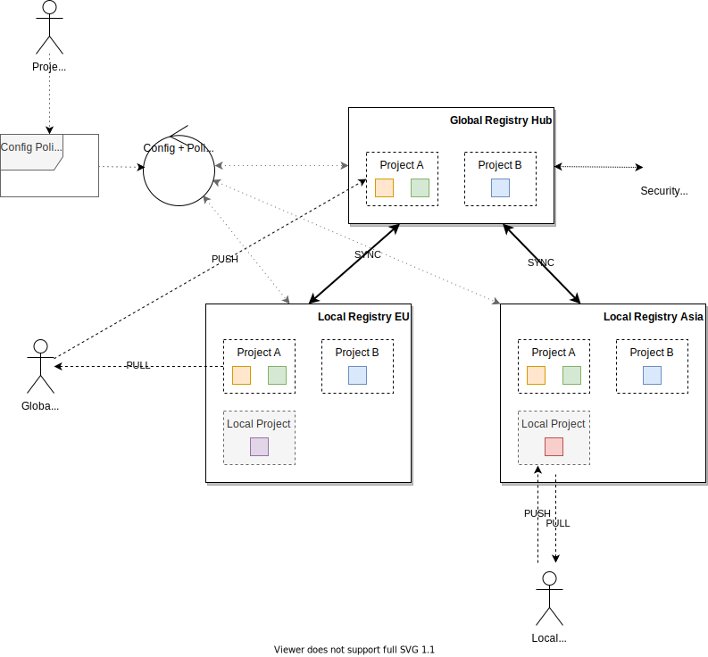

# Registryman Documentation

## Concepts
Registryman (Registry Manager) allows configuration of container image registry
projects, project members and project replication rules in a declarative way (by
virtue of k8s custom resources / YAML files) on top of multiple types of container image registries.

Registryman can manage configuration of multiple registries at once and supports building hierarchical
registry solutions, consisting of:

 - **Global Registry Hub**, which acts as a single source of truth for centralized image & vulnerability management,
 - **Multiple Local Registries** potentially located in different regions to have the images in close location to users.

The Registryman ensures automatic replication of images between the Global and Local registries based on
the intent described using Registryman API.

An example of such deployment is shown on the following picture:

To summarize the concepts shown on the picture:

- the setup consists of a single Global Registry Hub and multiple Local Registries,
- configuration and policies for projects across the whole setup can be managed using Registryman,
- Registryman ensures that projects, project members and project replication rules configuration is always synchronized across the setup,
- the users of global projects can push the images into the Global Registry Hub,
- images of the global projects will be automatically synchronized to all Local Registries,
- image consumers can pull the image from any Local (or Global) registry, e.g. based on their physical location,
- local project can exist within the Local Registries, they can be managed via Registryman, but are not replicated anywhere.

## Implementation Details
For more implementation details, you can review the following documents:

- [Registries and Projects](projects.md)
- [Data Model](datamodel.md)
- [Reconciliation](reconciliation.md)
- [Actions](actions.md)
