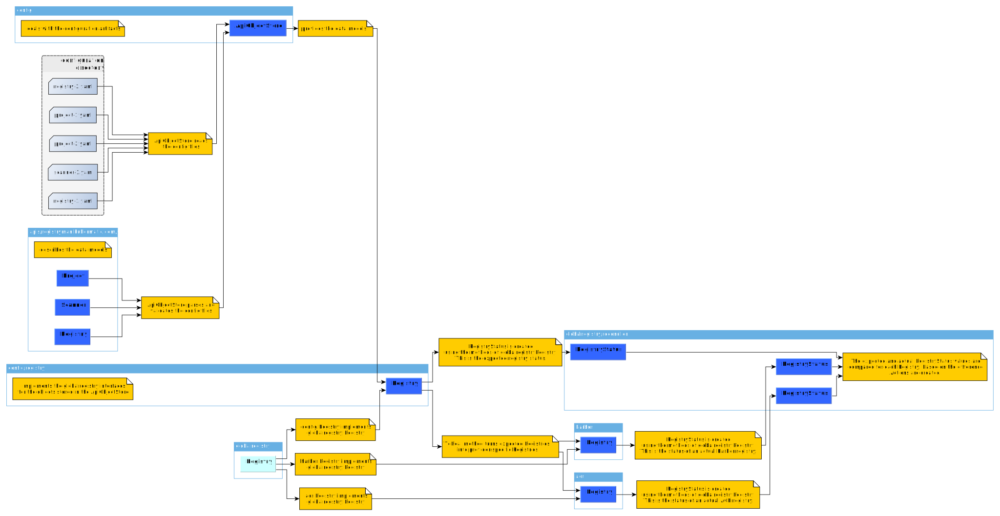

# Concept

Registryman follows a declarative configuration approach. The user describes the
**expected** state of the system. Registryman then collects the **actual** state
and then compares it to the expected state.

## Implementation details

The architecture or registryman is shown below.

### The main packages

The API (i.e. the format of the configuration files) are described by the
`apis/registryman.kubermatic.com/v1alpha1` package. 

The datastore of the parsed configuration files is implemented by the `config`
package.

The core of registryman is the `globalregistry` package. It defines a set of
interfaces that describe methods that registry provider shall implement.

Currently, there are 2 registry providers available: `harbor` and `acr`.

There is a virtual registry provider implementation in the `config/registry`
package. This provider implements the `globalregistry` interfaces. This virtual
registry does not support any state changer method, like project creation,
member assignment, etc.

It only supports the state discovery methods (get projects, get project
members). The discovered state information is gathered from the YAML
configuration files. Consequently, the `config/registry** is a registry
implementation that describes the expected state.

The `globalregistry/reconciler` package contains the functions and data types
used during reconciliation, e.g. the RegistryStatus type that describes the
expected and actual state of the registries.

### The reconciliation workflow

1. A `config.ApiObjectStore` is created by reading the YAML files. The files are
   parsed and validated too.
2. For each parsed registry, a `config/registry.Registry` value is created. This
   Registry type implements the `globalregistry` interfaces and as such it can
   be used to create the `globalregistry/reconciler.RegistryStatus` that
   describes the expected state of each registry.
3. Each parsed registry is turned into a provider-specific Registry data type,
   i.e. `acr.Registry` or `harbor.Registry` via the `ToReal` method.
4. For each provider-specific Registry value, the corresponding
   `globalregistry/reconciler.RegistryStatus` is created that describes the
   actual state of each registry.
5. The `globalregistry/reconciler.Compare` compares the expected and actual
   `RegistryStatus` for each managed registry. As a results a list of actions is
   returned.
6. The actions are performed in order one by one.
